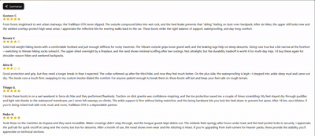

# Review Summarizer AI 🚀

An intelligent AI-powered application that automatically summarizes product reviews using advanced natural language processing. Built with modern web technologies and designed to provide quick insights from customer feedback.



## ✨ Features

- **AI-Powered Summarization**: Automatically generates concise summaries of product reviews using Google Gemini and OpenAI
- **Real-time Chat Interface**: Interactive chatbot for asking questions about products and reviews
- **Smart Review Analysis**: Processes multiple reviews to extract key insights and sentiment
- **Modern UI/UX**: Beautiful, responsive interface built with TailwindCSS and React
- **Database Integration**: Persistent storage with Prisma ORM and MySQL
- **TypeScript Support**: Full type safety across the entire application

## 🏗️ Architecture

This project follows a monorepo structure with separate client and server packages:

```
ReviewSummarizer/
├── packages/
│   ├── client/          # React frontend application
│   └── server/          # Node.js backend API
├── prisma/              # Database schema and migrations
└── README.md
```

## 🛠️ Tech Stack

### Frontend

- **React 19** - Modern React with latest features
- **TypeScript** - Type-safe development
- **TailwindCSS** - Utility-first CSS framework
- **Vite** - Fast build tool and dev server
- **Radix UI** - Accessible component primitives
- **React Query** - Server state management
- **React Hook Form** - Form handling

### Backend

- **Node.js** - JavaScript runtime
- **Express.js** - Web framework
- **Prisma** - Database ORM
- **MySQL** - Database
- **Google Gemini AI** - AI summarization
- **OpenAI** - Alternative AI provider
- **Bun** - Fast JavaScript runtime
